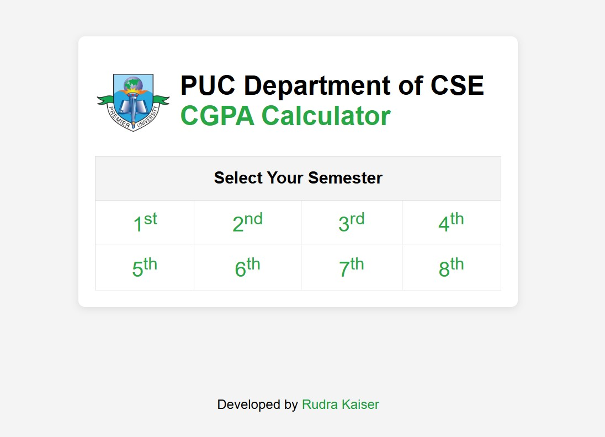
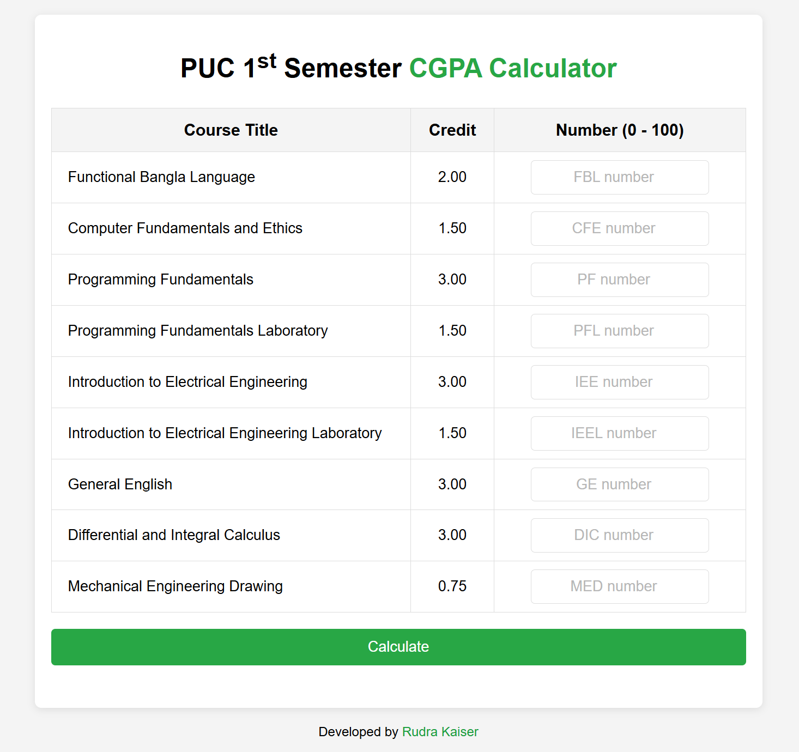

# 📊 PUC CSE CGPA Calculator

A web-based CGPA calculator designed for the **Computer Science and Engineering Department** of **[Premier University, Chittagong (PUC)](https://cse.puc.ac.bd/)**. This tool allows students to quickly calculate their CGPA semester by semester with ease and accuracy.

---

## 🚀 Features

- 🧮 Calculate CGPA for all 8 semesters
- 📚 Pre-loaded with subjects and credit values for each semester
- 🔢 Enter your marks (0–100), and it calculates GPA per subject and overall CGPA
- 🎨 Clean and responsive UI
- ⚡ Fast and lightweight

---

## 🖼️ Screenshots

### 🎯 Semester Selection Page


### 📘 1st Semester CGPA Calculator


---

## 🛠️ Technologies Used

- HTML5
- CSS3
- JavaScript

---

## 🧑‍💻 How to Use

- ### Process 1

   - **[Click Here](https://rudra-404.github.io/PUC_CSE_CGPA_Calculator/)** and go to the live site.

- ### Process 2

   1. Clone the repository:
      ```bash
      git clone https://github.com/rudra-404/PUC_CSE_CGPA_Calculator.git
      ```
   2. Open `index.html` in your browser.
   3. Select your semester.
   4. Enter your marks for each course.
   5. Click on **Calculate** to get your CGPA!

---

## ✅ Grading System

The app uses the standard university grading system to convert marks into grade points and calculate the weighted CGPA accordingly.

---

## ✨ Developer

Made with ❤️ by [Rudra Kaiser](https://github.com/rudra-404)

---

## 📜 License

This project is licensed under the **MIT License**. Feel free to use, modify, and distribute it with proper attribution.